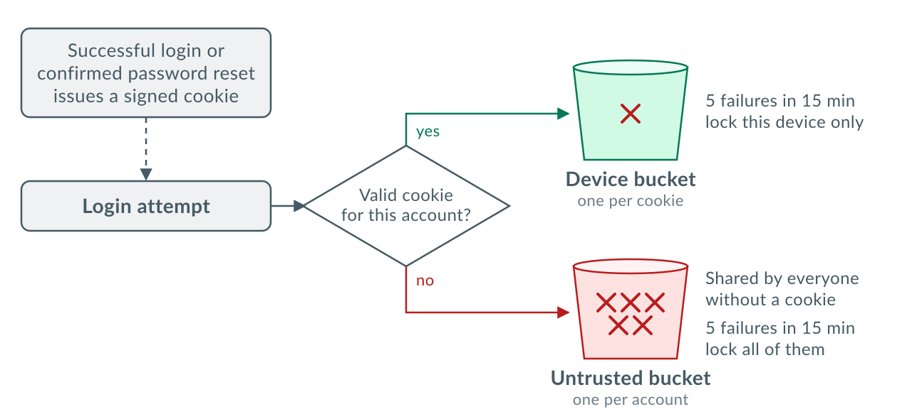

<!--
_class: lead
_footer: "* Usually"
_header: ""
-->

# Better* login rate limiting

https://github.com/knyghty/django-device-cookies

---

# Better than what?

- By username
- By IP address
- By IP address & username

---

# Why

- Stop brute forcing
- Without blocking legitimate users

---

# How

---

# Limitations

- Many attempts in parallel can slightly exceed limits
- Anything without a request object is untrusted
- One person can block logins for new devices

---

# Mitigation

- One person can block logins for new devices
- Can mitigate with a password reset link
- But UX is a little confusing

---

<!-- _class: lead -->

# Try it out

https://github.com/knyghty/django-device-cookies
